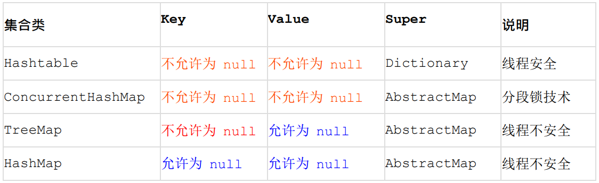

# 泰华Java编码规范 V1.0

---

## 规范当前版本

| 版本 | 日期 | 作者 | 审批人 | 版本记录 |
| --- | --- | --- | --- | --- |
| 0.1 | 2019/03/05 | 王守坤 | - | 初始版 |
| 1.0 | 2019/03/14 | 王守坤 | **郝敬全**、公飞 | 发布版 |

---

## 简要说明

- 基于《阿里巴巴Java开发手册》修订而成
- 目标，码出高效，码出质量
- 适用于公司内所有使用Java进行编码的软件，包括**新编写**和**修改**的代码

---

## 术语

- 强制：编码时必须遵守的约定、原则
- 推荐：编码时必须考虑的约定，除非背离是适当的，否则不应当产生
- 说明：对于强制或推荐规则的解释内容，如来源、原因、危害等
- 正例：对于强制和推荐规则给出的正面的示例
- 反例：对于强制和推荐规则给出的反面的示例

---

## 名词解释

- POJO: Plain Ordinary Java Object/ Plain Old Java Object
- OOP: Object Oriented Programming
- ORM: Object Relation Mapping
- NPE: java.lang.NullPointerException
- SOA: Service-Oriented Atrchitechture
- IDE: Integrated Development Environment
- OOM: java.lang.OutOfMemoryError

---

## 名词解释
- 一方库: 本工程内部子项目模块依赖的库（jar包）
- 二方库: 公司内部发布到中央仓库，可供公司内部其它应用依赖的库（jar包）
- 三方库: 公司之外的开源库（jar包）
- RPC: Remote Procedure Call
- 方法签名：由方法名称和一个参数列表（方法的参数的顺序和类型）组成

---

## 编程规约

---

### 命名规约 1 【强制】

- 代码中的命名均不能以下划线或美元符号开始，也不能以下划线或美元符号结束。

```java
// 反例
String _name, name_, name$;
Object $Object, object$;

void $func(){}
```

---

### 命名规约 2 【强制】

- 代码中的命名严禁使用拼音与英文混合的方式，更不允许直接使用中文的方式。

> 正确的英文拼写和语法可以让阅读者易于理解，避免歧义。注意，即使纯拼音命名方式也要避免采用。

```java
//反例

class DaZhePromotion {}// 打折

float getPingfenByName(String name); //评分

int 某变量 = 3; //中文命名
```

---

### 命名规约 3 【强制】

- 类名使用 UpperCamelCase 风格，必须遵从驼峰形式。


```java
// 正例
class MacroPolo{}

// 反例
class marcoPolo{}

```
---

### 命名规约 4 【强制】

- 方法名、参数名、成员变量、局部变量都统一使用 lowerCamelCase 风格，必须遵从驼峰形式。

```java
// 正例
String getName();

// 反例
String GetName();
String getname();
```

---

### 命名规约 5 【强制】

- 常量命名全部大写，单词间用下划线隔开，力求语义表达完整清楚，不要嫌名字长

```java
// 正例
public static final int MAX_STOCK_COUNT = 1;

// 反例
public static final int MAX_COUNT = 1;
public static final int max_stock_count = 1;
```

---

### 命名规约 6 【强制】

- 抽象类命名使用 Abstract 或 Base 开头；异常类命名使用 Exception 结尾；测试类命名以它要测试的类的名称开始，以 Test 结尾。

```java
// 正例

abstract class AbstractCoder{}

class BugComeBugGoException extends Exception{}

class JavaCoderTest{}

```

---

### 命名规约 7 【强制】

- 中括号是数组类型的一部分，数组定义如下：String[] args;

```java
// 反例
String args[];
```

---

### 命名规约 8 【强制】

- POJO 类中布尔类型的变量，都不要加 is，否则部分框架解析会引起序列化错误

```java

// 正例
public Boolean getSuccess(){
   // return
}

// 反例
public boolean isSuccess(){
    // return
}
```
---

### 命名规约 9 【强制】

- 包名统一使用小写，点分隔符之间有且仅有一个自然语义的英语单词。包名统一使用单数形式，但是类名如果有复数含义，类名可以使用复数形式。

```java
package com.telchina.common.util;

public final class StringUtils{}
```

---

### 命名规约 10 【强制】

- 杜绝完全不规范的缩写，避免望文不知义

```java
// 反例
abstract class AbsClass{}// Abstract 缩写命名成 Abs
```

---

### 命名规约 11 【推荐】

- 如果使用到了设计模式，建议在类名中体现出具体模式。
- 将设计模式体现在名字中，有利于阅读者快速理解架构设计思想。

```java
public class ResourceObserver{}
```

---

### 命名规约 12 【推荐】

- 接口类中的方法和属性不要加任何修饰符号（public 也不要加），保持代码的简洁性，并加上有效的 Javadoc 注释。尽量不要在接口里定义变量，如果一定要定义变量，肯定是与接口方法相关，并且是整个应用的基础常量

```java
public interface SomeInterface{
    String COMPANY = "telchina";
    
    void func();
    
    // 反例
    public abstract void func2();
}
```

--- 

### 命名规约 13.1 【强制】 13.2 【推荐】

- 接口和实现类的命名有两套规则
  1. 对于 Service 和 DAO 类，基于 SOA 的理念，暴露出来的服务一定是接口，内部的实现类用 Impl 的后缀与接口区别。
  1. 如果是形容能力的接口名称，取对应的形容词做接口名（通常是–able 的形式）。

```java
// 13.1
interface CacheService{}

class CacheServiceImpl implements CacheService{}

// 13.2
interface Translatable{}

abstract class AbstractTranslator implements Translatable{}
```

---

### 命名规约 14 【参考】

- 枚举类名建议带上 Enum 后缀，枚举成员名称需要全大写，单词间用下划线隔开

```java
enum DealStatusEnum{
  SUCCESS,
  UNKOWN_REASON
}
```

--- 

### 命名规约 15.1 【参考】

- Service/DAO 层方法命名规约
  - 获取单个对象的方法用 get 做前缀。
  - 获取多个对象的方法用 list 做前缀。
  - 获取统计值的方法用 count 做前缀。
  - 插入的方法用 save（推荐）或 insert 做前缀。
  - 删除的方法用 remove（推荐）或 delete 做前缀。
  - 修改的方法用 update 做前缀。
--- 

### 命名规约 15.2 【参考】

- 领域模型命名规约
  - 数据对象：xxxDO，xxx 即为数据表名。
  - 数据传输对象：xxxDTO，xxx 为业务领域相关的名称。
  - 展示对象：xxxVO，xxx 一般为网页名称。
  - POJO 是 DO/DTO/BO/VO 的统称，禁止命名成 xxxPOJO。

---

### 常量定义 1 【强制】

- 不允许出现任何魔法值（即未经定义的常量）直接出现在代码中

```java
// 反例
String key = "0x0801_" + id; // "0x0801_"具有一定业务规则意义，须定义常量
map.put(key, value);
```

---

### 常量定义 2 【强制】

- long 或者 Long 初始赋值时，必须使用大写的 L，不能是小写的 l，小写容易跟数字1 混淆，造成误解

```java
// 反例
Long a = 2l;

// 正例
Long b = 2L;
```

---

### 常量定义 3 【推荐】

- 不要使用一个常量类维护所有常量，应该按常量功能进行归类，分开维护。如：缓存相关的常量放在类：CacheConsts 下；系统配置相关的常量放在类：ConfigConsts 下

---

### 常量定义 4 【推荐】

- 常量的复用层次有五层：
  - 跨应用共享常量：放置在二方库中，通常是 client.jar 中的 constant 目录下。
  - 应用内共享常量：放置在一方库的 modules 中的 constant 目录下。
  - 子工程内部共享常量：即在当前子工程的 constant 目录下。
  - 包内共享常量：即在当前包下单独的 constant 目录下。
  - 类内共享常量：直接在类内部 private static final 定义。

---

### 常量定义 5 【推荐】

- 如果变量值仅在一个范围内变化用 Enum 类。
- 如果还带有名称之外的延伸属性，必须使用 Enum 类。

```java
    enum WeekDate{
        MONDAY(1), TUESDAY(2), WEDNESDAY(3), THURSDAY(4), FRIDAY(5),
        SATURDAY(6), SUNDAY(7);
        
        private final int value;
        WeekDate(int v){
            this.value = v;
        }

        public int getValue() {
            return value;
        }
    }
    
    
    void exmple(WeekDate weekDate){
      System.out.println(weekDate.getValue() > 5 ? "gogogo" : "nonono");
    }
```

---

### 格式规约 1 【强制】

- 大括号的使用约定。如果是大括号内为空，则简洁地写成{}即可，不需要换行；如果是非空代码块则：
  - 左大括号前不换行。
  - 左大括号后换行。
  - 右大括号前换行。
  - 右大括号后还有 else 等代码则不换行；表示终止右大括号后必须换行。
  
---

### 格式规约 2 【强制】

- 左小括号和字符之间不出现空格；同样，右小括号和字符之间也不出现空格；而左大括号前需要空格。

---

### 格式规约 3 【强制】

- if/for/while/switch/do 等保留字与左右括号之间都必须加空格

---

### 格式规约 4 【强制】

- 任何运算符左右必须加一个空格
- 运算符包括赋值运算符=、逻辑运算符&&、加减乘除符号、三目运行符等

---

### 格式规约 5 【强制】

- 缩进采用 4 个空格，禁止使用 tab 字符

---

### 格式规约1-5示例

```java
public static void main(String args[]) {
    // 缩进 4 个空格
    String say = "hello";
    // 运算符的左右必须有一个空格
    int flag = 0;
    // 关键词 if 与括号之间必须有一个空格，括号内的 f 与左括号，0 与右括号不需要空格
    if (flag == 0) { 
        System.out.println(say);
    }
    // 左大括号前加空格且不换行；左大括号后换行
    if (flag == 1) { 
        System.out.println("world");
        // 右大括号前换行，右大括号后有 else，不用换行
    } else {
        System.out.println("ok");
        // 在右大括号后直接结束，则必须换行
    }
}
```
---

### 格式规约 6 【强制】

- 单行字符数限制不超过 120 个，超出需要换行，换行时遵循如下原则：
  - 第二行相对第一行缩进 4 个空格，从第三行开始，不再继续缩进，参考示例。
  - 运算符与下文一起换行。
  - 方法调用的点符号与下文一起换行。
  - 在多个参数超长，逗号后进行换行。
  - 在括号前不要换行。

---

### 格式规约 6示例

```java
// 正例
StringBuffer sb = new StringBuffer();
//超过 120 个字符的情况下，换行缩进 4 个空格，并且方法前的点符号一起换行
sb.append("zi").append("xin")...
    .append("huang")...
    .append("huang")...
    .append("huang");
    
// 反例：
StringBuffer sb = new StringBuffer();
//超过 120 个字符的情况下，不要在括号前换行
sb.append("zi").append("xin")...append
    ("huang");
//参数很多的方法调用可能超过 120 个字符，不要在逗号前换行
method(args1, args2, args3, ...
    , argsX);
```

---

### 格式规约 7 【强制】

- 方法参数在定义和传入时，多个参数逗号后边必须加空格。

```java
method("a", "b", "c");
```
---

### 格式规约 8 【强制】

- IDE 的 text file encoding 设置为 UTF-8; IDE 中文件的换行符使用 Unix 格式，不要使用 windows 格式。

@quote[当你在 windows 的记事本里新建一个文件，输入"联通"两个字之后，保存，关闭，然后再次打开，你会发现这两个字已经消失了，代之的是几个乱码！呵呵，有人说这就是联通之所以拼不过移动的原因。]

阅读参考 [unicode](https://zh.wikipedia.org/wiki/Unicode) [UTF-8](https://zh.wikipedia.org/wiki/UTF-8)

--- 

### 格式规约 9 【推荐】

- 没有必要增加若干空格来使某一行的字符与上一行的相应字符对齐

---

### 格式规约 10 【推荐】

- 方法体内的执行语句组、变量的定义语句组、不同的业务逻辑之间或者不同的语义之间插入一个空行。相同业务逻辑和语义之间不需要插入空行。
- 没有必要插入多行空格进行隔开

---

### OOP 规约 1 【强制】

- 避免通过一个类的对象引用访问此类的静态变量或静态方法，无谓增加编译器解析成本，直接用类名来访问即可。

```java
class A {
   public static void hello(){}
}

// 正例
A.hello();

// 反例
new A().hello();
```
---

### OOP 规约 2【强制】

- 所有的覆写方法，必须加@Override 注解

---

### OOP 规约 3 【强制】

- 相同参数类型，相同业务含义，才可以使用 Java 的可变参数，避免使用 Object
- 可变参数必须放置在参数列表的最后
- 不提倡使用可变参数编程

---

### OOP 规约 4 【强制】

- 对外暴露的接口签名，原则上不允许修改方法签名，避免对接口调用方产生影响。接口过时必须加@Deprecated 注解，并清晰地说明采用的新接口或者新服务是什么。

---

### OOP 规约 5 【强制】

- 不能使用过时的类或方法

- 案例：
   - java.net.URLDecoder 中的方法 decode(String encodeStr) 这个方法已经过时，应该使用双参数 decode(String source, String encode)。
- 注意：
    - 接口提供方既然明确是过时接口， 那么有义务同时提供新的接口；作为调用方来说，有义务去考证过时方法的新实现是什么。

---

### OOP 规约 6 【强制】

- Object 的 equals 方法容易抛空指针异常，应使用常量或确定有值的对象来调用equals

```java
// 正例
"test".equals(str);
if (str != null && str.equals("test")){}

// 反例
str.equals("test");
```
--- 

### OOP 规约 7 【强制】

- 所有的相同类型的[包装类](http://www.weixueyuan.net/view/5990.html)对象之间值的比较，全部使用 equals 方法比较
   - 对于 Integer var=?在-128 至 127 之间的赋值，Integer 对象是在IntegerCache.cache 产生，会复用已有对象，这个区间内的 Integer 值可以直接使用==进行判断，但是这个区间之外的所有数据，都会在堆上产生，并不会复用已有对象，这是一个大坑， 推荐使用 equals 方法进行判断

```java
        Integer i1 = 1;
        Integer i2 = 1;
        Integer i3 = 1000;
        Integer i4 = 1000;
        
        System.out.println(i1 == i2);
        System.out.println(i3 == i4);
```

---

### OOP 规约 8 【强制】

- 关于基本数据类型与包装数据类型的使用标准如下：
   - 所有的 POJO 类属性必须使用包装数据类型
   - RPC 方法的返回值和参数必须使用包装数据类型
   - 所有的局部变量【推荐】使用基本数据类型

---

### OOP 规约 9 【强制】

- 序列化类新增属性时，请不要修改 serialVersionUID 字段，避免反序列失败；如果完全不兼容升级，避免反序列化混乱，那么请修改 serialVersionUID 值。

> RPC rmi/iiop

---

### OOP 规约 10 【强制】

- 构造方法里面禁止加入任何业务逻辑，如果有初始化逻辑，请放在 init 方法中

```java
class A{
   public A(){
      // 带有业务逻辑的代码
   }
}

class B{
   public B(){
      init();
   }
   
   private init(){
      // 带有业务逻辑的代码
   }
}
```

---
### OOP 规约 11 【推荐】

- POJO 类必须写 toString 方法。使用 IDE 的中工具：source> generate toString时，如果继承了另一个 POJO 类，注意在前面加一下 super.toString

> 在方法执行抛出异常时，可以直接调用 POJO 的 toString()方法打印其属性值，便于排查问题

---

### OOP 规约 12 【推荐】

- 使用索引访问用 String 的 split 方法得到的数组时，需做最后一个分隔符后有无内容的检查，否则会有抛 IndexOutOfBoundsException 的风险

```java
String str = "a,b,c,,";//预期为4
String[] arr = str.split(","); //实际是3
```

---

### OOP 规约 13 【推荐】

- 当一个类有多个构造方法，或者多个同名方法，这些方法应该按顺序放置在一起， 便于阅读

---

### OOP 规约 14 【推荐】

- 类内方法定义顺序依次是：公有方法或保护方法 > 私有方法 > getter/setter方法

> 公有方法是类的调用者和维护者最关心的方法，首屏展示最好；保护方法虽然只是子类关心，也可能是“模板设计模式”下的核心方法；而私有方法外部一般不需要特别关心，是一个黑盒实现；因为方法信息价值较低，所有 Service 和 DAO 的 getter/setter 方法放在类体最后。

---

### OOP 规约 15 【推荐】

- setter 方法中，参数名称与类成员变量名称一致，this.成员名=参数名。在getter/setter 方法中，尽量不要增加业务逻辑，增加排查问题的难度

```java
// 反例
public Integer getData(){ 
   if(true) {
      return data + 100;
   } else {
      return data - 100;
   }
}
```

---

### OOP 规约 16 【推荐】

- 循环体内，字符串的联接方式，使用 StringBuilder 的 append 方法进行扩展

```java
String str = "start"; 
for(int i=0; i<100; i++){
   str = str + "hello";
}

```

> 反编译出的字节码文件显示每次循环都会 new 出一个 StringBuilder 对象，然后进行append 操作，最后通过 toString 方法返回 String 对象，造成内存资源浪费

---

### OOP 规约 17 【推荐】

- final 可提高程序响应效率，声明成 final 的情况：
   - 不需要重新赋值的变量，包括类属性、局部变量。
   - 对象参数前加 final，表示不允许修改引用的指向。
   - 类方法确定不允许被重写。

---

### OOP 规约 18 【推荐】

- 慎用 Object 的 clone 方法来拷贝对象

> 对象的 clone 方法默认是浅拷贝，若想实现深拷贝需要重写 clone 方法实现属性对象的拷贝

---

### OOP 规约 19 【推荐】

- 类成员与方法访问控制从严：
   - 如果不允许外部直接通过 new 来创建对象，那么构造方法必须是 private
   - 工具类不允许有 public 或 default 构造方法
   - 类非 static 成员变量并且与子类共享，必须是 protected
   - 类非 static 成员变量并且仅在本类使用，必须是 private
   - 类 static 成员变量如果仅在本类使用，必须是 private
   - 若是 static 成员变量，必须考虑是否为 final
   - 类成员方法只供类内部调用，必须是 private
   - 类成员方法只对继承类公开，那么限制为 protected。

> 任何类、方法、参数、变量，严控访问范围。过宽泛的访问范围，不利于模块解耦。思考：如果是一个 private 的方法，想删除就删除，可是一个 public 的 Service 方法，或者一个 public 的成员变量，删除一下，不得手心冒点汗吗？变量像自己的小孩，尽量在自己的视线内，变量作用域太大，如果无限制的到处跑，那么你会担心的

---

### 集合处理 1 【强制】

- 关于 hashCode 和 equals 的处理，遵循如下规则：
  - 只要重写 equals，就必须重写 hashCode
  - 因为 Set 存储的是不重复的对象，依据 hashCode 和 equals 进行判断，所以 Set 存储的对象必须重写这两个方法
  - 如果自定义对象做为 Map 的键，那么必须重写 hashCode 和 equals

---

### 集合处理 2 【强制】

- 使用工具类 Arrays.asList()把数组转换成集合时，不能使用其修改集合相关的方法，它的 add/remove/clear 方法会抛出 UnsupportedOperationException 异常

---

### 集合处理 3 【强制】

- 不要在 foreach 循环里进行元素的 remove/add 操作。remove 元素请使用 Iterator方式，如果并发操作，需要对 Iterator 对象加锁

- [原因](https://www.hollischuang.com/archives/1776)

---

### 集合处理 4 【强制】

- 在 JDK7 版本以上，Comparator 要满足自反性，传递性，对称性，不然 Arrays.sort，Collections.sort 会报 IllegalArgumentException 异常
   - 自反性：x，y 的比较结果和 y，x 的比较结果相反
   - 传递性：x>y,y>z,则 x>z
   - 对称性：x=y,则 x,z 比较结果和 y，z 比较结果相同。
   
```java
// 反例
new Comparator<Student>() {
   @Override
   public int compare(Student o1, Student o2) {
      return o1.getId() > o2.getId() ? 1 : -1;
   }
}

```
   
--- 

### 集合处理 5 【推荐】

- 集合初始化时，尽量指定集合初始值大小

> ArrayList 尽量使用 ArrayList(int initialCapacity) 初始化。HashMap使用HashMap(int initialCapacity) 初始化。

---

### 集合处理 6 【推荐】

- 使用集合转数组的方法，必须使用集合的 toArray(T[] array)，传入的是类型完全一样的数组，大小就是 list.size()

```java
List<String> list = Arrays.asList("1","2");
// 反例
String[] array1 = (String[])list.toArray();
// 正例
String[] array2 = new String[list.size()];
array2 = list.toArray(array2);
```

---

### 集合处理 7 【推荐】

- 使用 entrySet 遍历 Map 类集合 KV，而不是 keySet 方式进行遍历

> keySet 其实是遍历了 2 次，一次是转为 Iterator 对象，另一次是从 hashMap 中取出key 所对应的 value。而 entrySet 只是遍历了一次就把 key 和 value 都放到了 entry 中，效率更高。如果是 JDK8，使用 Map.foreach 方法

---

### 集合处理 8 【推荐】

- 高度注意 Map 类集合 K/V 能不能存储 null 值的情况，如下表格：



---

### 集合处理 9 【参考】

- 合理利用好集合的有序性(sort)和稳定性(order)，避免集合的无序性(unsort)和不稳定性(unorder)带来的负面影响


---

### 集合处理 10 【参考】

- 利用 Set 元素唯一的特性，可以快速对一个集合进行去重操作，避免使用 List 的contains 方法进行遍历、对比、去重操作。

---

### 并发处理 1 【强制】

- 获取单例对象需要保证线程安全，其中的方法也要保证线程安全

```java
private volatile A aSingleton = null;

public A getASingleton(){
    if (aSingleton == null){
        synchronized(this){
            if (aSingleton == null){
               aSingleton = ....;              
            }
        }
    }
    return aSingleton;
}

// use coodex-utilities

private Singleton<A> aSingleton = new Singleton<A>(
    new Singleton.Builder<A>(){
      @Override
      public A build(){
          return ...;
      }      
    }
);

aSingleton.getInstance();
```

---

### 并发处理 2 【强制】

- 创建线程或线程池时请指定有意义的线程名称，方便出错时回溯

```java
public class TimerTaskThread extends Thread { 
   public TimerTaskThread(){
      super.setName("TimerTaskThread");
      // ...
   }
}
```

---

### 并发处理 3 【强制】

- 线程资源必须通过线程池提供，不允许在应用中自行显式创建线程

> 使用线程池的好处是减少在创建和销毁线程上所花的时间以及系统资源的开销，解决资源不足的问题。如果不使用线程池，有可能造成系统创建大量同类线程而导致消耗完内存或者“过度切换”的问题

---

### 并发处理 4 【强制】

- SimpleDateFormat 是线程不安全的类，一般不要定义为 static 变量，如果定义为static，必须加锁， _或者使用 DateUtils 工具类_

> 公司共用包

> org.coodex.util.Common#dateToStr(Date) 系列

> 如果是 JDK8 的应用，可以使用 Instant 代替 Date，LocalDateTime 代替 Calendar，DateTimeFormatter 代替Simpledateformatter，官方给出的解释：simple beautiful strong immutable thread-safe。

---

### 并发处理 5 【强制】

- 高并发时，同步调用应该去考量锁的性能损耗。能用无锁数据结构，就不要用锁；能锁区块，就不要锁整个方法体；能用对象锁，就不要用类锁

```java
public void a(){}  // 不加锁

public synchronized void b(){} // 方法体锁

public void c(){
  synchronized(lock){
    // 区块锁，推荐使用ReentrantLock
  }
  // 不需加锁的代码
}
public void d(){
   synchronized(this){} // 对象琐
   synchronized(A.class){} //类锁
}
```

---

### 并发处理 6 【强制】

- 对多个资源、数据库表、对象同时加锁时，需要保持一致的加锁顺序，否则可能会造成死锁

```java
// 反例
public void methodA(){
  synchronized(lockA){
    synchronized(lockB){
       ///
    }
  }
}

public void methodB(){
  synchronized(lockB){
    synchronized(lockA){
       ///
    }
  }
}
```

---

### 并发处理 7 【强制】

- 多线程并行处理定时任务时，Timer 运行多个 TimeTask 时，只要其中之一没有捕获抛出的异常，其它任务便会自动终止运行，使用 ScheduledExecutorService 则没有这个问题

---

### 并发处理 8 【推荐】

- 避免 Random 实例被多线程使用，虽然共享该实例是线程安全的，但会因竞争同一seed 导致的性能下降

> Random 实例包括 java.util.Random 的实例或者 Math.random()实例

> 在 JDK7 之后，可以直接使用 API ThreadLocalRandom，在 JDK7 之前，可以做到每个线程一个实例

---

### 并发处理 9 【推荐】

- 并发修改同一记录时，避免更新丢失，要么在应用层加锁，要么在缓存加锁，要么在数据库层使用[乐观锁](https://zh.wikipedia.org/wiki/%E4%B9%90%E8%A7%82%E5%B9%B6%E5%8F%91%E6%8E%A7%E5%88%B6)，使用 version 作为更新依据

> 如果每次访问冲突概率小于 20%，推荐使用乐观锁，否则使用[悲观锁](https://zh.wikipedia.org/wiki/%E6%82%B2%E8%A7%82%E5%B9%B6%E5%8F%91%E6%8E%A7%E5%88%B6)。乐观锁的重试次数不得小于 3 次

---

### 并发控制 10 【推荐】

- 通过双重检查锁（double-checked locking）（在并发场景）实现延迟初始化的优化问题隐患(可参考 The "Double-Checked Locking is Broken" Declaration),推荐问题解决方案中较为简单一种（适用于 JDK5 及以上版本），将目标属性声明为 volatile(挖了头) 型

---

### 并发处理 11 【参考】

- volatile 解决多线程内存不可见问题。对于一写多读，是可以解决变量同步问题， 但是如果多写，同样无法解决线程安全问题。如果是 count++操作，使用如下类实现： `AtomicInteger count = new AtomicInteger(); count.addAndGet(1); `如果是 JDK8，推荐使用 LongAdder 对象，比 AtomicLong 性能更好（减少乐观锁的重试次数）。

参考阅读 [CAS: compare and swap](https://zh.wikipedia.org/wiki/%E6%AF%94%E8%BE%83%E5%B9%B6%E4%BA%A4%E6%8D%A2)

---

### 并发处理 12 【参考】

- HashMap 在容量不够进行 resize 时由于高并发可能出现死链，导致 CPU 飙升，在开发过程中注意规避此风险

---

### 并发处理 13 【参考】

- ThreadLocal 无法解决共享对象的更新问题，ThreadLocal 对象建议使用 static 修饰。这个变量是针对一个线程内所有操作共有的，所以设置为静态变量，所有此类实例共享此静态变量 ，也就是说在类第一次被使用时装载，只分配一块存储空间，所有此类的对象(只要是这个线程内定义的)都可以操控这个变量。

---

### 控制语句 1 【强制】

- 在一个 switch 块内，每个 case 要么通过 break/return 等来终止，要么注释说明程序将继续执行到哪一个 case 为止；在一个 switch 块内，都必须包含一个 default 语句并且放在最后，即使它什么代码也没有。

---

### 控制语句 2 【强制】

- 在 if/else/for/while/do 语句中必须使用大括号，即使只有一行代码，避免使用下面的形式：

```java
if (condition) statements;
```

---

### 控制语句 3 【推荐】部分情况【强制】

- 尽量少用 else
- 非要用`if()...else if()...else...`
   - 【强制】请勿超过 3 层， 超过请使用状态设计模式
   - 【推荐】方法内大括号的嵌套层数最多不要超过5层

> 逻辑上超过 3 层的 if-else 代码可以使用卫语句([参考](https://www.cnblogs.com/Braveliu/p/7364369.html))，或者状态模式来实现

---

### 控制语句 4 【推荐】

- 除常用方法（如 getXxx/isXxx）等外，不要在条件判断中执行其它复杂的语句，将复杂逻辑判断的结果赋值给一个有意义的布尔变量名，以提高可读性

---

### 控制语句 5 【推荐】

- 循环体中的语句要考量性能，以下操作尽量移至循环体外处理，如定义对象、变量、获取数据库连接，进行不必要的 try-catch 操作（这个 try-catch 是否可以移至循环体外）

---

### 控制语句 6 【推荐】

- 接口入参保护，这种场景常见的是用于做批量操作的接口

> 接口入参保护:程序内对接口的传参进行校验，尤其是在做批量操作的接口，对于批量操作的数量要做限制，比如请求批量操作的数据量应小于10万条或更小。这样的限制（入参保护）可以减轻服务器的负担与出错的几率。

---

### 控制语句 7 【参考】

- 方法中需要进行参数校验的场景:
  - 调用频次低的方法
  - 执行时间开销很大的方法，参数校验时间几乎可以忽略不计，但如果因为参数错误导致中间执行回退，或者错误，那得不偿失
  - 需要极高稳定性和可用性的方法
  - 对外提供的开放接口，不管是 RPC/API/HTTP 接口
  - 敏感权限入口
---

### 控制语句 8 【参考】

- 方法中不需要参数校验的场景：
   - 极有可能被循环调用的方法，不建议对参数进行校验。但在方法说明里必须注明外部参数检查。
   - 底层的方法调用频度都比较高，一般不校验。毕竟是像纯净水过滤的最后一道，参数错误不太可能到底层才会暴露问题。一般 DAO 层与 Service 层都在同一个应用中，部署在同一台服务器中，所以 DAO 的参数校验，可以省略。
   - 被声明成 private 只会被自己代码所调用的方法，如果能够确定调用方法的代码传入参数已经做过检查或者肯定不会有问题，此时可以不校验参数。

---

### 注释规约 1 【强制】

- 类、类属性、类方法的注释必须使用 Javadoc 规范，使用/\*\*内容\*/格式，不得使用//xxx 方式

> 在 IDE 编辑窗口中，Javadoc 方式会提示相关注释，生成 Javadoc 可以正确输出相应注释；在 IDE 中，工程调用方法时，不进入方法即可悬浮提示方法、参数、返回值的意义，提高阅读效率

---

### 注释规约 2 【强制】

- 所有的抽象方法（包括接口中的方法）必须要用 Javadoc 注释、除了返回值、参数、异常说明外，还必须指出该方法做什么事情，实现什么功能

> 对子类的实现要求，或者调用注意事项，请一并说明

---

### 注释规约 3-5 【强制】

- 所有的类都必须添加创建者信息。
- 方法内部单行注释，在被注释语句上方另起一行，使用//注释。方法内部多行注释使用/\* \*/注释，注意与代码对齐。
- 所有的枚举类型字段必须要有注释，说明每个数据项的用途。

---

### 注释规约 6-7 【推荐】

- 与其“半吊子”英文来注释，不如用中文注释把问题说清楚。专有名词与关键字保持英文原文即可。
   - 反例：“TCP 连接超时”解释成“传输控制协议连接超时”，理解反而费脑筋。
- 代码修改的同时，注释也要进行相应的修改，尤其是参数、返回值、异常、核心逻辑等的修改。
   - 代码与注释更新不同步，就像路网与导航软件更新不同步一样，如果导航软件严重滞后， 就失去了导航的意义。

---

### 注释规约 8 【参考】

- 注释掉的代码尽量要配合说明，而不是简单的注释掉

> 代码被注释掉有两种可能性：1）后续会恢复此段代码逻辑。2）永久不用。前者如果没有备注信息，难以知晓注释动机。后者建议直接删掉（代码仓库保存了历史代码）

---

### 注释规约 9 【参考】

- 对于注释的要求：第一、能够准确反应设计思想和代码逻辑；第二、能够描述业务含义，使别的程序员能够迅速了解到代码背后的信息。完全没有注释的大段代码对于阅读者形同天书，注释是给自己看的，即使隔很长时间，也能清晰理解当时的思路；注释也是给继任者看的，使其能够快速接替自己的工作

---

### 注释规约 10 【参考】

- 好的命名、代码结构是自解释的，注释力求精简准确、表达到位。避免出现注释的一个极端：过多过滥的注释，代码的逻辑一旦修改，修改注释是相当大的负担

---

### 注释规约 11 【参考】

- 特殊注释标记，请注明标记人与标记时间。注意及时处理这些标记，通过标记扫描， 经常清理此类标记。线上故障有时候就是来源于这些标记处的代码
   - TODO
   - FIXME

---

### 其他

- 【强制】DRY，Don't Repeat Yourself
- 【强制】避免方法体过长，进行必要的方法抽取，保持代码逻辑清晰
- 【强制】在使用正则表达式时，利用好其预编译功能，可以有效加快正则匹配速度
- 【强制】注意 Math.random() 这个方法返回是 double 类型，注意取值的范围 0≤x<1（能够取到零值，注意除零异常），如果想获取整数类型的随机数，不要将 x 放大 10 的若干倍然后取整，直接使用 Random 对象的 nextInt 或者 nextLong 方法

---

### 其他

- 【强制】获取当前毫秒数 System.currentTimeMillis(); 而不是 new Date().getTime();
- 【推荐】不要在视图模板中加入任何复杂的逻辑
- 【推荐】任何数据结构的构造或初始化，都应指定大小，避免数据结构无限增长吃光内存

---

## 异常日志

---

### 异常处理 1 【强制】

- 不要捕获 Java 类库中定义的继承自 RuntimeException 的运行时异常类，如： IndexOutOfBoundsException / NullPointerException，这类异常由程序员预检查来规避，保证程序健壮性。

---

### 异常处理 2 【强制】

- 异常不要用来做流程控制，条件控制，因为异常的处理效率比条件分支低

---

### 异常处理 3 【强制】

- 对大段代码进行 try-catch，这是不负责任的表现。catch 时请分清稳定代码和非稳定代码，稳定代码指的是无论如何不会出错的代码。对于非稳定代码的 catch 尽可能进行区分异常类型，再做对应的异常处理。

---

### 异常处理 4 【强制】

- 捕获异常是为了处理它，不要捕获了却什么都不处理而抛弃之，如果不想处理它，请将该异常抛给它的调用者。最外层的业务使用者，必须处理异常，将其转化为用户可以理解的内容

---

### 异常处理 5 【强制】

- 有 try 块放到了事务代码中，catch 异常后，如果需要回滚事务，一定要注意手动回滚事务

---

### 异常处理 6 【强制】

- finally 块必须对资源对象、流对象进行关闭，有异常也要做 try-catch

> 资源对象、流对象主要包括数据库连接对象、IO对象，比如常见的InputStream、OutputStream、Reader、Writer、Connection、Statement、ResultSet、Socket等等

> 如果 JDK7，可以使用 try-with-resources 方式

---

### 异常处理 7 【强制】

- 不能在 finally 块中使用 return，finally 块中的 return 返回后方法结束执行，不会再执行 try 块中的 return 语句

---

### 异常处理 8 【强制】

- 捕获异常与抛异常，必须是完全匹配，或者捕获异常是抛异常的父类

---

### 异常处理 9 【推荐】

- 方法的返回值可以为 null，不强制返回空集合，或者空对象等，必须添加注释充分说明什么情况下会返回 null 值。调用方需要进行 null 判断防止 NPE 问题

> 本规约明确防止 NPE 是调用者的责任。即使被调用方法返回空集合或者空对象，对调用者来说，也并非高枕无忧，必须考虑到远程调用失败，运行时异常等场景返回 null 的情况

---

### 异常处理 10 【推荐】

- 防止 NPE，是程序员的基本修养，注意 NPE 产生的场景：
   - 返回类型为包装数据类型，有可能是 null，返回 int 值时注意判空
   - 数据库的查询结果可能为 null
   - 集合里的元素即使 isNotEmpty，取出的数据元素也可能为 null
   - 远程调用返回对象，一律要求进行 NPE 判断
   - 对于 Session 中获取的数据，建议 NPE 检查，避免空指针
   - 级联调用 obj.getA().getB().getC()；一连串调用，易产生 NPE。

---

### 异常处理 11 【推荐】

- 在代码中使用“抛异常”还是“返回错误码”，对于公司外的 http/api 开放接口必须使用“错误码”（http接口推荐使用[http状态码](https://zh.wikipedia.org/wiki/HTTP%E7%8A%B6%E6%80%81%E7%A0%81)作为错误码）；而应用内部推荐异常抛出；跨应用间 RPC 调用优先考虑使用 Result 方式，封装 isSuccess、“错误码”、“错误简短信息”

---

### 异常处理 12 【推荐】

- 定义时区分 unchecked / checked 异常，避免直接使用 RuntimeException 抛出， 更不允许抛出 Exception 或者 Throwable，应使用有业务含义的自定义异常。推荐业界已定义过的自定义异常，如：DAOException / ServiceException 等

---

### 日志规约 1 【强制】

- 应用中不可直接使用日志系统（Log4j、Logback）中的 API，而应依赖使用日志框架SLF4J（Simple Logging Facade for Java） 中的 API，使用门面模式的日志框架，有利于维护和各个类的日志处理方式统一

---

### 日志规约 2 【强制】

- 日志文件推荐至少保存 15 天，因为有些异常具备以“周”为频次发生的特点

---

### 日志规约 3 【强制】

- 应用中的扩展日志（如打点、临时监控、访问日志等）命名方式：appName_logType_logName.log。logType:日志类型，推荐分类有stats/desc/monitor/visit 等；logName:日志描述。这种命名的好处：通过文件名就可知道日志文件属于什么应用，什么类型，什么目的，也有利于归类查找

---

### 日志规约 4 【强制】

- 对 trace/debug/info 级别的日志输出，必须使用条件输出形式或者使用占位符的方式

```java
if (logger.isDebugEnabled()) {
  logger.debug("Processing trade with id: " + id + " symbol: " + symbol);
}


logger.debug("Processing trade with id: {} symbol : {} ", id, symbol);

```

---

### 日志规约 5 【强制】

- 避免重复打印日志，浪费磁盘空间，务必在 log4j.xml 中设置 additivity=false

---

### 日志规约 6 【强制】

- 异常信息应该包括两类信息：案发现场信息和异常堆栈信息。如果不处理，那么往上抛

---

### 日志规约 7 【推荐】

- 可以使用 warn 日志级别来记录用户输入参数错误的情况，避免用户投诉时，无所适从。注意日志输出的级别，error 级别只记录系统逻辑出错、异常等重要的错误信息。如非必要，请不要在此场景打出 error 级别。

---

### 日志规约 8 【推荐】

- 谨慎地记录日志。生产环境禁止输出 debug 日志；有选择地输出 info 日志；如果使用 warn 来记录刚上线时的业务行为信息，一定要注意日志输出量的问题，避免把服务器磁盘撑爆，并记得及时删除这些观察日志

> 大量地输出无效日志，不利于系统性能提升，也不利于快速定位错误点。记录日志时请思考：这些日志真的有人看吗？看到这条日志你能做什么？能不能给问题排查带来好处？

---

## 安全规约

---

### 安全规约 1 【强制】

- 隶属于用户个人的页面或者功能必须进行权限控制校验

> 防止没有做水平权限校验就可随意访问、操作别人的数据，比如查看、修改别人的订单

---

### 安全规约 2 【强制】

- 用户敏感数据禁止直接展示，必须对展示数据脱敏

> 查看个人手机号码会显示成:158\*\*\*\*9119，隐藏中间 4 位，防止隐私泄露

---

### 安全规约 3 【强制】

- 用户输入的 SQL 参数严格使用参数绑定或者 METADATA 字段值限定，防止 SQL 注入， 禁止字符串拼接 SQL 访问数据库

---

### 安全规约 4 【强制】

- 用户请求传入的任何参数必须做有效性验证

---

# 以上

---

## 我们要做点什么？

https://github.com/thjavacoders/makeCodeBetter

---

# 谢谢
